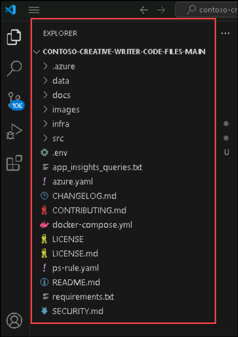
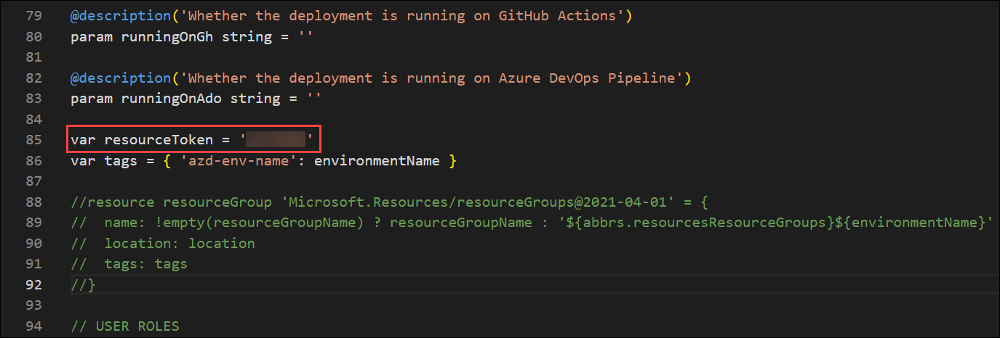

# Exercise 1: Deploying Resources with Azure Developer CLI

### Estimated Duration: 1 Hour

## Lab Scenario

In this exercise, you will deploy the necessary resources for your FastAPI application using the Azure Developer CLI (azd). You will set up your environment, initialize and configure the deployment process, and use azd commands to provision and deploy services in Azure. 

## Lab Objectives

By the end of this exercise, you will be able to:

- Understand the Azure Developer CLI and its deployment workflow.
- Streamline Azure resource deployment using the Azure Developer CLI (`azd`).

### Task 1: Understanding Azure Developer CLI and the Deployment Workflow

In this task, you will gain an understanding of the Azure Developer CLI (azd) and how it facilitates the deployment of cloud resources. You'll explore the main bicep file, the core infrastructure template for your application, and learn about the primary resources it defines, including key parameters, dependencies, and outputs. By the end, you'll be familiar with how azd uses this file to automate provisioning, setting the foundation for deploying resources with ease in the next steps.

> **Lab Tip:** **AZD (Azure Developer CLI)** is a command-line tool designed to streamline the process of building, deploying, and managing Azure applications. It simplifies the interaction with Azure resources by allowing developers to define infrastructure using code, deploy applications, and manage environments in a more efficient and automated way.

1. From the desktop, open **Visual Studio Code**.

   

1. In **Visual Studio Code**, go to the **File** menu at the top and select **Open Folder...**

   

1. Navigate to `C:\creative-writer\contoso-creative-writer-code-files-main` directory, click on **Select folder**.

   .png)

1. Once you open the folder in Visual Studio Code, a pop-up will appear asking, *"Do you trust the authors of the files in this folder?"* Click **Yes, I trust the authors**.

   

1. Once you have the **contoso-creative-writer-code-files-main** directory opened, ensure you have the source code files from the **Explorer pane**.

   
   
1. From the explorer menu, navigate to the `/infra/main.bicep` file to review. A Bicep file is a simplified, readable syntax for defining and deploying Azure resources, which is compiled into ARM templates for deployment.

   
   
1. In the `main.bicep`, navigate to line number 85, variable **resourcetoken** and update the value with **<inject key="DeploymentID" enableCopy="true"/>**. 

   > **Please note:** If you missed updating this, the next task will fail to deploy the resources successfully.

   

### Task 2: Streamlining Azure Resource Deployment with Azure Developer CLI (azd)

In this task, you will be using the Azure Developer CLI (azd) to deploy the resources defined in your Bicep templates to Azure. The Azure Developer CLI simplifies the process of managing infrastructure as code, allowing you to efficiently deploy, manage, and monitor your applications and resources directly from the command line.

1. On the **Visual Studio Code**, open a **New Terminal** by selecting **Terminal** from the top menu bar and then clicking on **New Terminal**.

   

1. Once the terminal is opened, run the following command to sign in and authenticate the azd tool.

   ```bash
   azd auth login
   ```
   
1. Once you run the above command, a sign in page opens up, as you have already logged in to portal you just need to select your account.

1. Once you have logged in successfully, navigate back to your terminal and run the following command to authenticate the **Azure CLI** tool as well.

   ```bash
   az login
   ```

   > **Note:** You may need to minimize Visual Studio Code pane to see the pop up window to sign in.

1. Once you are on the pop up window, select **Work or school account** and click on **Continue**.

   

2. On the **Sign into Microsoft Azure** tab, you will see the login screen. Enter the following email/username and then click on **Next**.

   - Email/Username: <inject key="AzureAdUserEmail"></inject>
     
     

3. Now enter the following password and click on **Sign in**.

   - Password: <inject key="AzureAdUserPassword"></inject>

1. When prompted, click **No, sign in to this app only**.

1. Return to your **Visual Studio Code** terminal. You may now be prompted to select a subscription from a list. Enter **1** and press **Enter**.

1. Run the following command to set the execution policy to avoid any security-related issues.

   ```
   Set-ExecutionPolicy Bypass -Scope LocalMachine -Force
   ```

1. Once you have successfully logged in, run the following command, which will deploy all the defined resources in Azure.

   ```
   azd up
   ```

1. Once you run this command, it will prompt you to select a subscription. Just hit enter and continue.

   

1. In the next prompt, it will ask to select a location. Use the arrow keys and select **<inject key="region" enableCopy="false"/>** region from the list. **If you select any other region, the deployment will fail due to less quota for the OpenAI Model**.

   .png)

1. In the next prompt, select **rg-creative-<inject key="DeploymentID" enableCopy="false"/>** for resource group.

   .png)

   > This may take up to 15 minutes to deploy all the resources, till then please move to the next exercise as that is a read-only exercise where you will get to know the core application and technology stacks used.

   > If you encounter any deployment errors, try rerunning the `azd up` command to resolve them.

   > **Congratulations** on completing the task! Now, it's time to validate it. Here are the steps
   > - Hit the Validate button for the corresponding task. If you receive a success message, you can proceed to the next task. 
   > - If not, carefully read the error message and retry the step, following the instructions in the lab guide.
   > - If you need any assistance, please contact us at cloudlabs-support@spektrasystems.com. We are available 24/7 to help you out.
   
   <validation step="45d3bb64-1c15-4974-9ead-629db5887289" />

## Summary

In this exercise, you have learned how to use the Azure Developer CLI (AZD) to deploy resources for your application. You explored how to define and configure infrastructure using a Bicep file, initialized tracing for monitoring, and successfully deployed resources such as container apps and AI environments using AZD.

### Click on Next >> to proceed to the next exercise.
